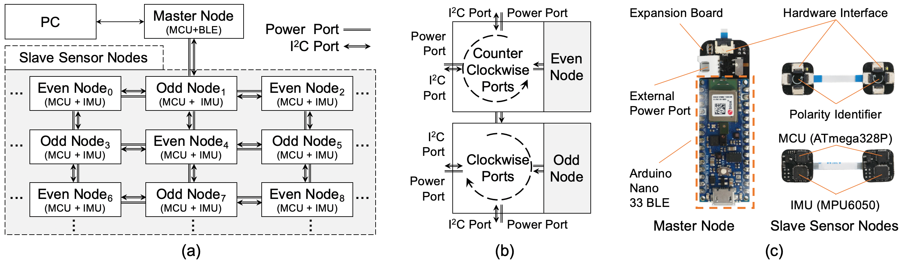
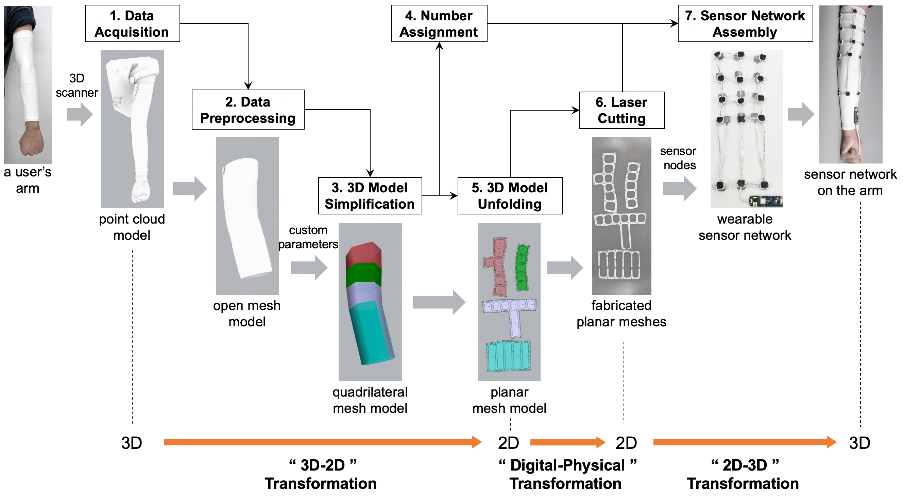
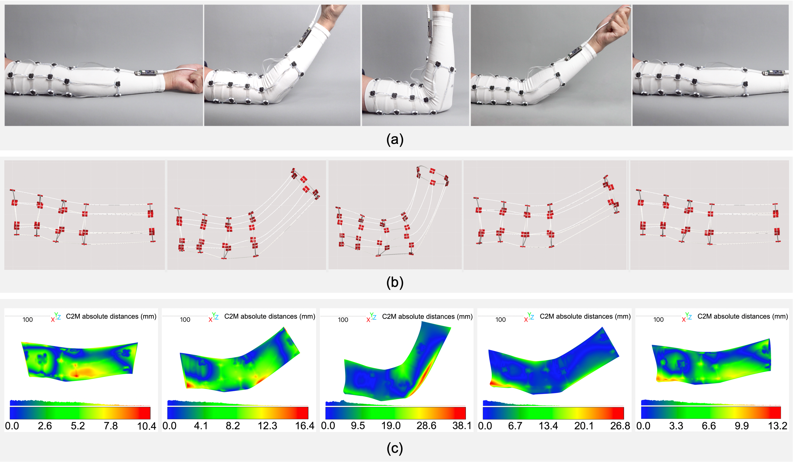

# 3D Deformation Capture via A Configurable Self-Sensing IMU Sensor Network

Motion capture technologies are crucial for reconstructing human movements and have applications across various domains. This project introduces a novel approach to fine-grained motion capture (i.e., deformation capture), leveraging a configurable self-sensing IMU sensor network to effectively bridge the gap between traditional vision-based and IMU-based methods.

## Introduction

The research on motion capture technologies can be broadly categorized into two methods: vision-based and IMU-based. While vision-based methods offer high accuracy in capturing complex 3D geometrical deformations, they rely on costly optical equipment and are limited by the line-of-sight occlusion problem. On the other hand, IMU-based methods are more lightweight but struggle to accurately capture fine-grained 3D deformations.

Our work presents a configurable self-sensing IMU sensor network designed to bridge the gap between vision-based methods and IMU-based methods. By proposing a novel kinematic chain model and introducing three geometric priors, our approach enhances the accuracy of 3D deformation capture.

## Key Contributions

- **Kinematic Chain Model:** A new model based on the four-bar linkage is proposed to describe the minimum deformation process of 3D deformations accurately.
- **Geometric Priors:** Utilization of initial shape, material properties, and motion features as geometric priors to assist the kinematic chain model in reconstructing deformations.
- **Customizable 3D Sensor Networks:** A fabrication method for customizing 3D sensor networks for different objects, inspired by origami, facilitating a 3D–2D–3D digital–physical transition.

## Experimental Results

Our experimental results show that the proposed method achieves performance comparable with state-of-the-art methods, marking a significant advancement in the field of motion capture technology.

## Project 

### Architecture

*The architecture of the sensor network and its hardware implementation.*

### Customized Construction Pipeline

*The customized construction pipeline of a wearable 3D sensor network.*

### Prototypes

*Arm test prototypes demonstrating the application of the sensor network.*

## Reference

> Zihong Zhou, Pei Chen, Yinyu Lu, Qiang Cui, Deying Pan, Yilun Liu, Jiaji Li, Yang Zhang, Ye Tao, Xuanhui Liu, Lingyun Sun, and Guanyun Wang. 2023. **3D Deformation Capture via A Configurable Self-Sensing IMU Sensor Network**. *Proc. ACM Interact. Mob. Wearable Ubiquitous Technol.* 7, 1, Article 42 (March 2023), 24 pages. https://doi.org/10.1145/3580874

