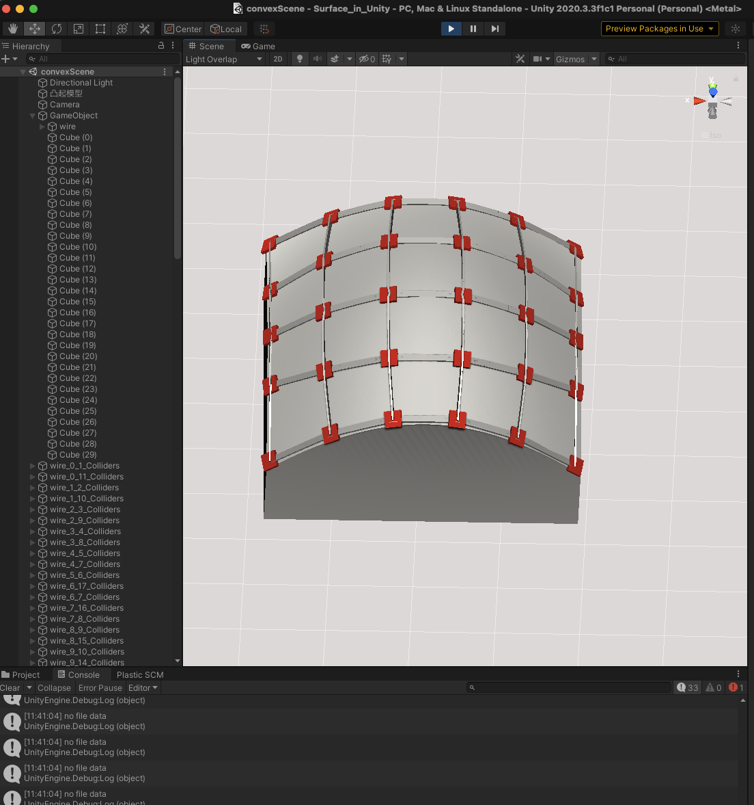
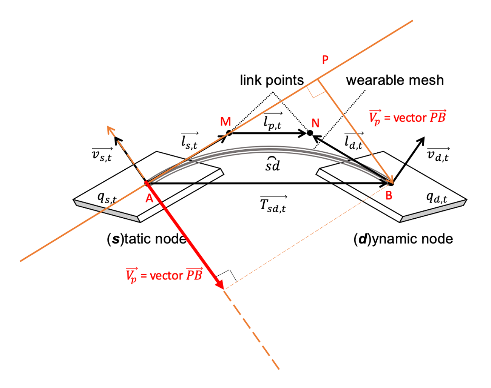

download link：https://drive.google.com/file/d/16p3Sn6lFGuD6ZLJt9GZeo2y6Fk6v-0Zn/view?usp=drive_link

The download link contains the Unity project code for the paper's evaluation section on rotating parabolic surfaces (Unity version: 2020.3.3f1c1). This project consists of a total of 30 sensor nodes, each attached to a CS code file (located at: Assets/Scripts/controler/ankleControler/CubeX_Controller.cs) with the same processing routine. The CS code file contains detailed initialization, motion chain model construction, and other code. 
  
Additionally, upon running the project directly, Unity should display content similar to the following image (test.png), with 30 nodes attached to the surface of a rotating parabolic surface, indicating successful initialization. To further read sensor data and reconstruct shapes in Unity, modify the debug_flag in the initialParameters.txt file (located at: Assets/Scripts/controler/initialParameters.txt) to true, and run the serialread.py file (located at: Assets/Scripts/python/serialread.py). This Python file will read data from all sensor nodes via serial port and save it to TXT files for Unity to read.

Furthermore, three additional images explaining the principles of the motion chain model and code interpretation are provided for your reference. 
  

